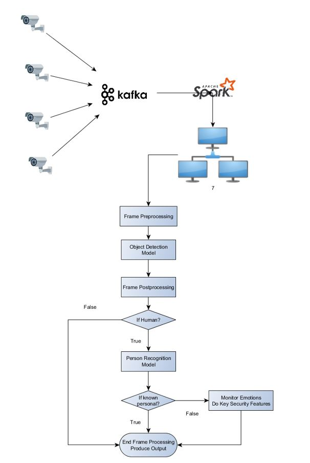
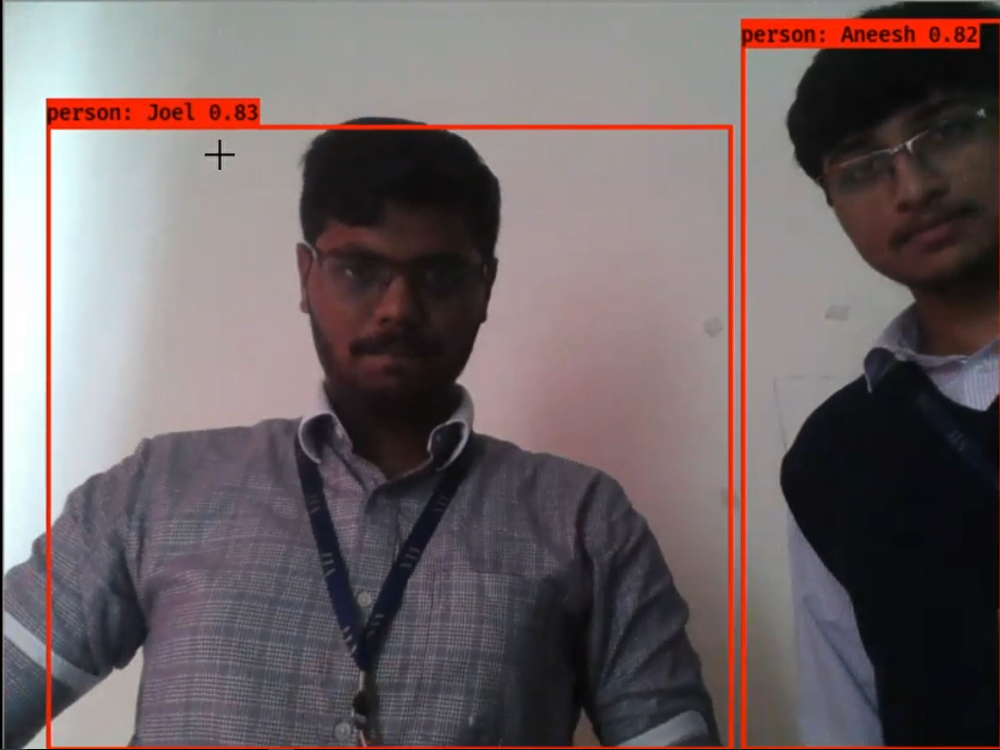

# A DEFINITIVE FRAMEWORK FOR DISTRIBUTED AI SURVEILLANCE SYSTEM
## 1. Introduction
Security has been a major problem in the history of mankind. From the era of civilization starting near the rivers to current day modern world, security and privacy is a vital component in our day to day life. We need more and more security as recent crime rates increase our paranoia towards society. We are in constant fear of invasion of privacy and threatened by the ever-increasing crime rates. There is no perfect solution for security. A security problem is an asymmetric warfare in which the attacker has all the time he needs to harm the victim and that he needs just one hole in the security system to achieve it. But, with the ever increase of AI Technology and Deep-Learning, we are able to do more than just basic classification especially in image processing. We are able to push the boundary of image processing and bring it to an era of where pre-processing and hand-engineering is a distant past. With Neural Networks we are able to mimic human like learning characteristics in computer system. The extension or rather say, the Break-through in Neural Network was the Convolution Neural Network introduced in LeNet – 5 Architecture [LeCun et al., 1998. Gradient-Based learning applied to document recognition] which showed parallel processing and effective way of processing images for feature extraction. CNN paved way for AI Image processing and AI-based feature extraction which totally diminished the need for complex feature extraction algorithm for image processing. With a huge array of AI Models and Technologies to tackle the image processing problem, we are pushed to decide on which model to use. A single object detection model has around 10 variations each with its own pros and con. We need to choose the model that is most suitable for our scenario. In the field of surveillance, we are also forced to choose between privacy and security. Too tight surveillance systems compromise privacy and too light surveillance systems compromise security. With the Surveillance Dilemma in mind, we need to consider multiple factors before we decide on what model to use for our proposed framework. In this paper, we have proposed a distributed AI Surveillance Framework powered by Image Processing and recent core Technologies in Distributed and Parallel Computing with lays out a definitive guide for designing a distributed AI based surveillance system. 
To test our proposed framework, We have developed an AI model which is capable of detecting multiple objects in real-time. Objects include Person, cell phone, Animals, Car, utensils, weapons etc. which will help us to predict crime before it occurs. This AI model is based on the YOLO (You only look once) Model [Joseph Redmon et al., 2015.You Only Look Once: Unified, Real-Time Object Detection]. We have also developed another AI model which will work in pipeline with our Object Detection Model for person recognition (Not face recognition). This Person Detection Model detects if the person is authorised or if he is a recognised trustable person or not. The Person Detection Model is built with transfer learning from Inception Model especially Inception v2 model [Christian Szegedy et al., 2014. Going Deeper with Convolutions]. The entire pipeline helps us with all the utilities to build a Distributed Security System for Real-time surveillance from multiple camera feeds. For distributed system cluster, we used commodity systems and used Apache Spark and Apache Kafka for Camera Cluster and Compute node Clusters. The main feature of the proposed framework lies in its flexibility to swap in and out new and cheaper technologies. It features a pipeline based AI Model which would require more and more hardware as the pipeline length increases.
The objective of the Framework is to provide cheap and effective solution for a smart surveillance system. We are focussing on reducing the cost by maximizing our usage of open-source COTS and minimize the use of exotic technology. The cluster systems for processing can be just local commodity system based clusters just like a Beowulf Clusters which has Kafka and Zookeeper running on top of it with YARN and Spark. The Kafka is a Subscriber model which solves the Producer and Consumer problem with higher fault tolerance plus it allows multiple Consumers (Processing Element) for the same Producer (Camera feed) and Vice-Versa. This helps us develop a distributed camera system.

## 2. Requirements
### 2.1. Software Requirements
 - Python 3.6 or above (Python 2.7.x support in future. Please stop using Python 2.7.x. please Stop it. Get some help)
 - CUDA Toolkit Version 9.0 or greater
 - CuDNN version 7.4
 - Kafka
 - Hadoop
 - Spark
#### 2.1.1 Python Packages Required
 - numpy
 - pandas
 - tensorflow==1.12
 - opencv-python
 - pillow
 - keras
 - scipy
 - sklearn
 - socket
 - matplotlib
 - kafka-python
 - flask

These are mentioned in requirements.txt
### 2.2. Hardware Requirements
 - Laptop with Nvidia GTX 1060 (6 GB VRAM) or Greater
 - Atleast 8 GB RAM DDR4 (2133 MHz) (Mine is 16 GB 2400 MHz)
 - Any CPU with 4 Cores will be optimal. Have atleast 2.4 GHz Base

## 3. How To execute
The project was focused to detect objects that can cause security threats in a way of training an AI capable of fast processing each frame in a Live CCTV Relay. The AI model consisting of 2 AI models co-existing together work in parallel. We have extensively used the best of both OpenCV and Pillow Library for image processing, to maximize the Frames Per Second of the output relay. 

This tutorial is meant to reproduce the research/project done. This Repo is under the BSD 3 license which exercises no permission for publishing and patenting this framework

To get the weights for this model, please download from here from my mega cloud storage
[click here](https://mega.nz/#F!xPpknQ7K). Download it as yolo.h5 and place it in the model_data/ folder

### 3.1 Single Node Relay:
For pure testing purpose, a single node version is implemented in python. To run this, execute SingleNode.py file with python 3.6.3 or greater. The steps to reproduce the work for a single node is as follows:

1.	Get CUDA Toolkit v9.0 from here [Click here](https://developer.nvidia.com/cuda-90-download-archive?target_os=Windows&target_arch=x86_64) and follow its instruction to setup CUDA v9.0 for our project
2.	Open a terminal on the project folder
3.	Type the following in the terminal:
  
4.	This will install all required packages to execute SingleNode.py
5.	Now execute the program SingleNode.py by typing in the terminal:
 
6.	The output of the processed Live Feed would be given as output in a GUI window.
7.	To add a new user as a known one, take at least 10 shots of the person with a good quality camera from all angles and luminosities as much as possible and Create a directory within DataBase directory in the project with that person’s name and move all these pictures into that directory. Then rerun the program SingleNode.py again as given in Step 6.
For SingleNode.py to effectively give 60FPS for 480p, the minimum hardware requirements must be followed. Support for AMD GPUs are future scope of the project.

### 3.2 Cluster Node Relay:
This mode is the original app purpose which uses Kafka Cluster as a mean for setting up Live Relay Feeding over Network. For a proper 480p relay with 45 FPS would require Top-end Live Relay Equipment and normal LAN cables or Wi-Fi won’t cut it out. With that being said, we need to establish Zookeeper server on top of which Kafka cluster would be setup with the processing servers and all the cameras. First, we need to setup Zookeeper.
Check here [https://kafka.apache.org/quickstart] for Zookeeper easy setup followed by Kafka. We will be needing Java JDK version 8 or more and Scala 2.12. Also, we would need python 3.6.3 or greater.
After the above setup, please follow the following instructions to execute it. The processing servers must have CUDA version 9.0 or greater. Get CUDA Toolkit v9.0 from here [https://developer.nvidia.com/cuda-90-download-archive?target_os=Windows&target_arch=x86_64] and follow its instruction to setup CUDA v9.0 for our project. Note that this is not needed in our cameras. The cameras must have Raspberry Pi setup to work or the cam must be a Smart Camera with Network facilities integrated. 
#### 3.2.1 CAMERA:
Follow the following instructions, 
1.	Just move VideoProducer.py script into the camera and pip install Kafka-Python package in the python.
2.	Build or install OpenCV in the camera.
3.	The camera must be in the cluster as a member of the Kafka Cluster to produce video relays.
4.	Run VideoProducer.py in the camera

#### 3.2.2 PROCESSING SERVER:
Follow the following instructions,
1.	Get CUDA Toolkit v9.0 from here [Click here](https://developer.nvidia.com/cuda-90-download-archive?target_os=Windows&target_arch=x86_64) and follow its instruction to setup CUDA v9.0 for our project
2.	To add a new user as a known one, take at least 10 shots of the person with a good quality camera from all angles and luminosities as much as possible and Create a directory within DataBase directory in the project with that person’s name and move all these pictures into that directory
3.	Open a terminal on the project folder
4.	Type the following in the terminal:
  
5.	This will install all required packages to executeVideoClient.py
6.	Now execute the program VideoClient.py by typing in the terminal:
 
7.	The output of the processed Live Feed would be given as output in localhost:5000 as a Flask Web Application. Note that we can change this output.

## 4 Framework used

## 5. Output

## 6. References
 - Nvidia CUDA. (2018). Retrieved from [CUDA Docs](http://developer.download.nvidia.com/compute/cuda/9.0/Prod/docs/sidebar/CUDA_Quick_Start_Guide.pdf)
 - Apache Kafka. (2018). Retrieved from https://kafka.apache.org/quickstart
 - Cui, N. (2018). Applying Gradient Descent in Convolutional Neural Networks. Journal Of Physics: Conference Series, 1004, 012027. doi: 10.1088/1742-6596/1004/1/012027
 - Fei-Fei, L., Deng, J., & Li, K. (2010). ImageNet: Constructing a large-scale image database. Journal Of Vision, 9(8), 1037-1037. doi: 10.1167/9.8.1037
 - Han, J., & Kwak, K. (2017). Image Classification Using Convolutional Neural Network and Extreme Learning Machine Classifier Based on ReLU Function. The Journal Of Korean Institute Of Information Technology, 15(2), 15-23. doi: 10.14801/jkiit.2017.15.2.15
 - He, K., Zhang, X., Ren, S., & Sun, J. (2015). Deep Residual Learning for Image Recognition.
 - Hinton, G., LeCun, Y., & Y.ng, A. (1998). ReLU.
 - Lecun, Y., Bottou, L., Bengio, Y., & Haffner, P. (1998). Gradient-based learning applied to document recognition. Proceedings Of The IEEE, 86(11), 2278-2324. doi: 10.1109/5.726791
 - Redmon, J. (2018). YOLO: Real-Time Object Detection. Retrieved from [YOLO Paper](https://pjreddie.com/darknet/yolo/)
  - Szegedy, C., Liu, W., Jia, Y., Sermanet, P., Reed, S., & Anguelov, D. et al. (2018). Going Deeper with Convolutions. 
 - Logistic Regression. (2003). Retrieved from http://ssrn.com/abstract¼360300 or http://dx.doi.org/10.2139/ssrn.360300
 - Logit models from economics and other fields, Cambridge University Press, Cambridge, England, (2003). pp. 149–158) Retrieved from http://ssrn.com/abstract¼360300 or http://dx.doi.org/10.2139/ssrn.360300 ; Logit models from economics and other fields, Cambridge University Press, Cambridge, England, 2003, pp. 149–158
 - Griewank, A. (2014). ON AUTOMATIC DIFFERENTIATION AND ALGORITHMIC LINEARIZATION. Pesquisa Operacional, 34(3), 621-645. doi: 10.1590/0101-7438.2014.034.03.0621
 - Karen Simonyan & Andrew Zisserman.  (2015). VGG-16
 - Russakovsky et al., (2014). ImageNet Large-Scale Visual Recognition Challenge (ILSVRC)
 - Sermant et al., (2013). OverFeat: Integrated Recognition, Localization and Detection using Convolutional Networks
 - Min Lin, Qiang Chen et al., (2014). Network in Network
 - Mathew D. Zeiler and Rob Fergus et al., (2013). Visualizing and Understanding Convolutional Networks Paper
 - Florian Schroff, Dmitry Kalenichenko et al., (2015). FaceNet: A Unified Embedding for Face Recognition and Clustering
 - Cauchy (1847)., Hadamard (1908)., Kelley (1960)., Bryson (1961)., Bryson and Denham (1961)., Pontryagin et al., (1961)., Dreyfus (1962)., Wilkinson (1965)., Amari (1967)., Bryson and Ho (1969)., Director and Rohrer, (1969). Gradient Descent
 - Christian Szegedy, Sergey Ioffe et al., (2016). Inception-v4, Inception-ResNet and the Impact of Residual Connections on Learning
 - Leibniz, (1676)., L'Hopital 
 - DP, Bellman, (1957)., à la Dynamic Programming
